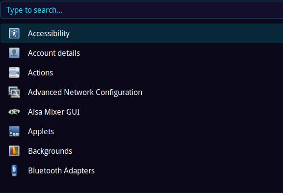

# launcher



A **lightweight**, native Wayland application launcher with automatic X11
fallback, search, app icons, and **Bedrock Linux cross-stratum** process
routing. Built with Cairo and Pango.

---

## ✨ Features

- **Wayland native** — uses `zwlr_layer_shell_v1` for overlay rendering; drops
  back to X11 automatically when Wayland is unavailable
- **Fast search** — real-time filtering across desktop entry names and `Exec`
  fields as you type
- **App icons** — automatic icon resolution from `XDG_DATA_DIRS` and standard
  theme directories; renders PNG, SVG (via **librsvg**), XPM, JPEG, and WebP
  assets with proper scaling
- **Cross-distro launching** — type a Bedrock stratum prefix in the search bar
  to execute commands inside any installed Linux distribution
- **Background detachment** — all launched processes are spawned with I/O
  suppressed and run independently after the launcher closes

---

## 📦 Dependencies

| Package          | Arch                        | Debian / Ubuntu                                    | Fedora                                           |
|------------------|-----------------------------|----------------------------------------------------|--------------------------------------------------|
| wayland          | `wayland`                   | `libwayland-dev`                                   | `wayland-devel`                                  |
| wayland-protocols| `wayland-protocols`         | `wayland-protocols`                                | `wayland-protocols-devel`                        |
| cairo            | `cairo`                     | `libcairo2-dev`                                    | `cairo-devel`                                    |
| pango            | `pango`                     | `libpango1.0-dev`                                  | `pango-devel`                                    |
| xkbcommon        | `libxkbcommon`              | `libxkbcommon-dev`                                 | `libxkbcommon-devel`                             |
| librsvg          | `librsvg`                   | `librsvg2-dev`                                     | `librsvg2-devel`                                 |

### Quick install

```bash
# Arch
sudo pacman -S wayland wayland-protocols cairo pango libxkbcommon librsvg

# Debian / Ubuntu
sudo apt install libwayland-dev libcairo2-dev libpango1.0-dev \
  libxkbcommon-dev wayland-protocols librsvg2-dev

# Fedora
sudo dnf install wayland-devel wayland-protocols-devel cairo-devel \
  pango-devel libxkbcommon-devel librsvg2-devel
```

---

## 🔨 Build & Install

```bash
make
sudo make install
```

The binary is placed at `/usr/local/bin/launcher`.

---

## 🚀 Usage

Bind to a key in your compositor (e.g. Hyprland):

```conf
bind = SUPER, SPACE, exec, launcher
```

- **Type** to filter applications by name or command
- **Arrow keys** to navigate the list
- **Enter** to launch the selected entry
- **Esc** to close

Typing a raw command in the search bar and pressing Enter will execute it
directly via `sh -c`, even when no desktop entry matches.

---

## 🏔️ Bedrock Linux

Prefix any command with a distribution shortcut to run it inside a specific
Bedrock stratum:

| Prefix   | Stratum    | Example                          |
|----------|------------|----------------------------------|
| `arch:`  | `arch`     | `arch:firefox`                   |
| `deb:`   | `debian`   | `deb:apt update`                 |
| `fed:`   | `fedora`   | `fed:dnf upgrade`                |

Any other prefix before a colon is passed through as the stratum name
directly — `ubuntu:`, `gentoo:`, `alpine:`, `nixos:`, `void:`, etc. all work
without configuration.

